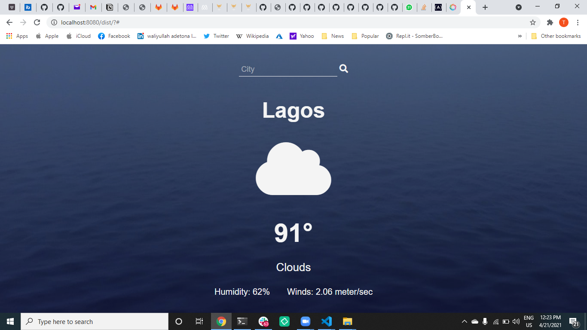

# Weather App

> The Weather App project comes at the end of the Asynchronous Javascript and APIs section of the Javascript course in Microverse. It tests the knowledge of the student about asynchronous communication with promises or async/await and when to use them. [here is the prolect link](https://www.theodinproject.com/paths/full-stack-javascript/courses/javascript/lessons/weather-app)

## Features
 User can :
 - Create a new project
 - Create a new to do to the specific project
 - Update the weather
 - Delete the todo

## Built with
- Javascript
- Webpack
- HTML
- Css
- WeatherMap

## Getting Started

- Clone the repo `https://github.com/taiwo2/weather-app.git`
- cd `into` the project
- Run `git pull origin weather`
- Run `yarn install` or `npm install` to install dependencies
- On the terminal run `npm run start` open up the live server

## Authors

👤 Taiwo Adetona

- Github: [@taiwo2](https://github.com/taiwo2)

- LinkedIn: [Taiwo Adetona](https://www.linkedin.com/in/taiwo-adetona/)

- Twitter: [@TaiwoAdetona4](https://twitter.com/TaiwoAdetona4/)

## 🤝 Contributing

Contributions, issues and feature requests are welcome!

Feel free to check the [issues page](issues/).

## Show your support

Give a ⭐️ if you like this project!

## 📝 License

MIT License